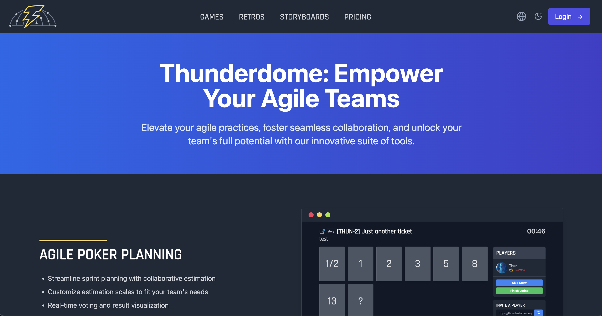

# Thunderdome

🆓 Free to use! [Thunderdome Open Source Poker Planner](https://thunderdome.dev/) with 💵 [Premium Hosted Options Available](https://thunderdome.dev/subscriptions/pricing)

## Remote team collaboration with agile poker planning, sprint retrospectives, user story mapping and async team stand-ups (checkins).

# Guides

- [Installation Guide](docs/INSTALLATION.md)
- [Configuring Thunderdome](docs/CONFIGURATION.md)
- [User Guide](docs/GUIDE.md)
- [Contributing Guide](docs/CONTRIBUTING.md) for details on our code of conduct, and the process for submitting pull
  requests to us.
- [Developing Guide](docs/DEVELOPING.md) for details on setting up your local and required steps for code changes.
- [Testing Guide](docs/TESTING.md) for details on how to test (unit and end to end) changes made to Thunderdome.
- [Security Policy](docs/SECURITY.md) for details on how to submit a vulnerability report.

# Donations

For those who would like to donate a small amount for my efforts or monthly hosting costs of Thunderdome.dev I accept
paypal.

